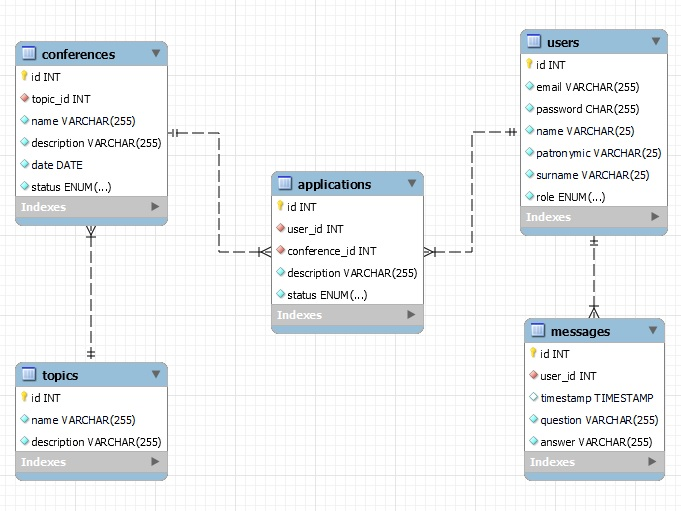

# EPAM_JWD_July-2021_Final-Project
## Final project for EPAM Java Web Development online course
### Topic №20
### Conference organization system
The administrator creates topics, conferences. A participant registers and submits an application to one or more conferences. The administrator checks the application for compliance with the conference topic and confirms/rejects the application. The participant can withdraw the application, ask the Administrator a question.
### Система организации конференций
Администратор создает темы, конференции. Участник регистрируется и подает заявку в одну или несколько конференций. Администратор проверяет заявку на соответствие тематике конференции и подтверждает\отклоняет заявку. Участник может снять заявку, задать вопрос Администратору.
### Database schema

